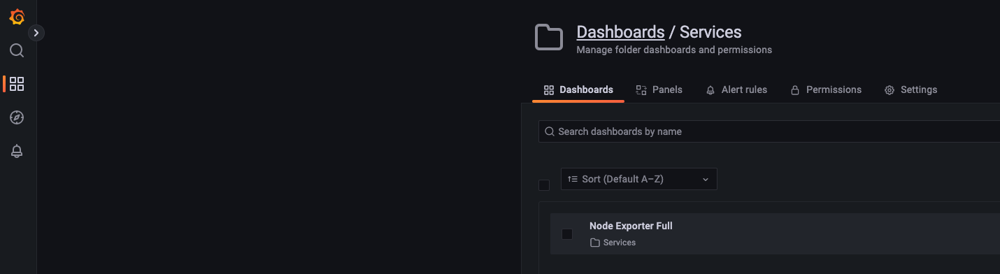

# Is Node.js single-threaded or multi-threaded?

https://jaanhio.me/blog/nodejs-single-multi/

It's both.

Also did some performance test to verify differences between using a blocking function (e.g `crypto.randomFillSync`) vs non-blocking function (e.g `crypto.randomFill`).

To try it yourself, see the steps below.

---

## Setup

3 things:
* node.js application
* performance test using [locust](https://github.com/locustio/locust)
* monitoring using grafana + prometheus + node-exporter stack

The setup steps below assumes you will be running the application using a VM and load test + monitoring using the host machine. 

If you intend to run the application on a separate machine (recommended), you can skip the "Node.js application" setup step and refer to the setup scripts (`setup-node-exporter.sh` and `setup-nodejs.sh`) instead for installing Node.js and node-exporter on whichever server you are using. 

```
git clone git@github.com:jaanhio/is-nodejs-single-or-multithreaded.git
```
---

#### Node.js application

Ideally you should be running this application on a separate machine to avoid noisy neighbour effect.

But if that's not an option, you can consider using a VM via [Vagrant](https://www.vagrantup.com/) for as much isolation as possible. Also, it makes it easier to observe the processes compared to the much noisier machine you are using right now.

The `VagrantFile` is configured to:
* create a VM
* install [nvm](https://github.com/nvm-sh/nvm)
* using `nvm` to install `node`
* create a sync folder to the `server/` directory where the node.js application code is
* setup node-exporter process listening on port 9100 (default). metrics are exposed on the `/metrics` endpoint.

```
cd is-nodejs-single-or-multithreaded
vagrant up
```

```
ssh -i ~/.vagrant.d/insecure_private_key vagrant@192.168.60.21
```

```
cd /tmp/server
npm install
npm run start
```

---

#### Locust + Grafana + Prometheus

```
docker-compose -f ./load-test/docker-compose.yaml up -d
```

This will create:
* Locust master + worker containers. Navigate to `http://localhost:8089` to access the master UI.
* Prometheus container scraping metrics from node-exporter endpoint (make sure to update the `static_configs` target in `prometheus.yml`). Navigate to `http://localhost:9090` on your browser to see the configurations.
* Grafana container with Prometheus datasource and node-exporter dashboard provisioned. Navigate to `http://localhost:3000` on your browser. Default login credentials: `admin: admin`

To get to the dashboard,
1. Click on second option "Dashboards" on the left navbar
2. Under the "Browse" tab, click on "Services"
3. You should see a "Node exporter Full" option. Click on that.



---

## Performance test

All load test related configurations are located in the `locustfile.py`.

Since we are testing performance difference between a blocking and non-blocking function call at any one time, the file only contains a single task.

To start, navigate to `http://localhost:8089` to access the master UI.

Edit the "Number of users", "Spawn rate" and "Host" (targeting the nodejs application).

Once done, click on the "Start swarming" button to begin testing.

#### Loading changes to the locustfile.py

The containers only load the file on initialisation and does not automatically load new changes.

After you have made changes, you will have to restart the containers.